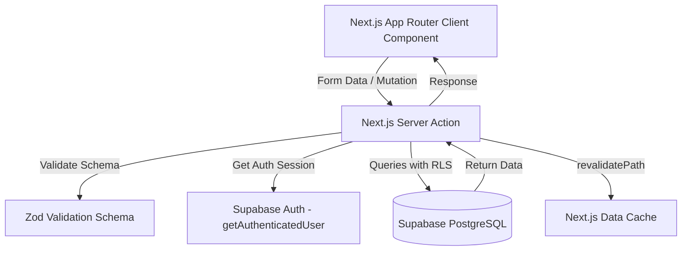

---
# System Architecture & Technical Design — Mellow Café System

> **Auto-generated by DocCraft** | Source: `file:///c:/Users/cyril/OneDrive/Desktop/Mellow/src/` | Last verified: 2026-07-25
>
> ⚠️ If this documentation doesn't match the code, the CODE is the source of truth. Please update these docs.

---

## Technical Stack Overview

| Tier | Technology | Rationale / Key Capabilities |
|---|---|---|
| **Framework** | **Next.js 15 (App Router)** | Server Components for low bundle sizes, Server Actions for type-safe RPC data operations |
| **Language** | **TypeScript 5** | Strict type safety across client UI, server actions, and database models |
| **Database & Auth**| **Supabase (PostgreSQL)** | Managed database with native Row-Level Security (RLS) for multi-tenancy |
| **Styling** | **Tailwind CSS v4 + Lucide React** | Utility-first responsive design, dark mode, high-contrast mobile layout |
| **Form & Validation**| **Zod + React Hook Form** | Runtime validation schemas shared across client modals and server actions |

---

## Architectural Principles & Design Patterns



### 1. Server Actions as Primary API Surface
Instead of constructing REST endpoints or tRPC routers, the application uses **Next.js Server Actions** (`'use server'`). This simplifies client-server data fetching by reducing boilerplate while retaining server-side validation with Zod.

### 2. Multi-Tenant Data Isolation via Supabase RLS
All database tables enforce Row-Level Security. Every read, write, update, and delete is scoped to `auth.uid() = user_id`. Server code never bypasses RLS, ensuring complete data privacy per café owner account.

### 3. Dual-Unit Bulk Purchasing & Package-Based Costing Engine
Café owners frequently purchase inventory in bulk cases/boxes (e.g., 1 box of 100 cups for ₱500) but sell or track items individually. 

#### Mathematical Formulas:
1. **Unit Cost Auto-Calculation:**
   $$\text{Unit Cost} = \frac{\text{Package Price}}{\text{Items Per Package}}$$
2. **Restock Conversion:**
   $$\text{Stock Added (pieces)} = \text{Packages Restocked} \times \text{Items Per Package}$$
3. **Dual Stock Display:**
   $$\text{Boxes Count} = \lfloor \frac{\text{Current Stock (pieces)}}{\text{Items Per Package}} \rfloor, \quad \text{Remainder Pieces} = \text{Current Stock} \pmod{\text{Items Per Package}}$$

### 4. Resilient Inventory & Non-Blocking POS
When recording sales, inventory stock is decremented automatically. To ensure speed during peak rush hours, sales are **never blocked** even if inventory drops below zero. Over-sales result in negative stock counts and warning banners, alerting owners to sync physical inventory.

---

## Project Structure

```
Mellow/
├── src/
│   ├── app/
│   │   ├── (auth)/             # Authentication routes (login, signup)
│   │   ├── (dashboard)/        # Main app shell & routes
│   │   │   ├── actions.ts      # Global dashboard server actions
│   │   │   ├── analytics/      # Financial reports & CSV export
│   │   │   ├── calculators/    # Costing & pricing calculators
│   │   │   ├── inventory/      # Stock management & bulk costing
│   │   │   ├── sales/          # POS Quick Tap, Batch, & Reconciliation
│   │   │   └── dashboard/      # Overview metrics & daily breakeven target
│   │   ├── globals.css         # Styling design tokens & Tailwind imports
│   │   └── layout.tsx          # Root HTML shell & fonts
│   ├── components/
│   │   ├── analytics/          # Sales & profit charts, export triggers
│   │   ├── inventory/          # Product tables, add/edit modals, restock modal
│   │   ├── layout/             # Top navigation, sidebar, mobile navigation
│   │   ├── sales/              # Quick tap grid, batch table, reconciliation form
│   │   └── ui/                 # Reusable primitive UI controls
│   ├── lib/
│   │   ├── config.ts           # Supabase environment configuration
│   │   ├── constants.ts        # App constants & categories
│   │   ├── csv-export.ts       # CSV generation utilities
│   │   ├── supabase/           # Server & client Supabase instantiations
│   │   ├── utils.ts            # Formatting helpers (Currency, dates)
│   │   └── validations/        # Zod input validation schemas
│   └── types/
│       ├── database.ts         # Supabase TypeScript interfaces & schemas
│       └── index.ts            # Type re-exports
└── supabase/
    └── migrations/             # Database SQL migration scripts
```

---

## Architecture Decision Records (ADRs)

### ADR-001: Next.js Server Actions over REST Endpoints
- **Status:** Accepted
- **Context:** The application requires fast full-stack iteration for inventory CRUD and POS transactions without maintenance overhead of separate API route handlers.
- **Decision:** Use Server Actions located inside route directories (`actions.ts`).
- **Consequences:** Eliminates API route boilerplate; automatically typed; enables seamless `revalidatePath` server cache invalidation.

### ADR-002: Dual-Unit Package Costing Schema Design
- **Status:** Accepted
- **Context:** Raw materials and menu supplies are bought in boxes/packages but consumed per piece.
- **Decision:** Add `package_price`, `items_per_package`, and `package_unit_name` to `products` table while keeping `unit_cost` as the primary mathematical foundation for COGS.
- **Consequences:** Provides exact unit-level cost precision down to 4 decimal places while letting users input intuitive package pricing.
