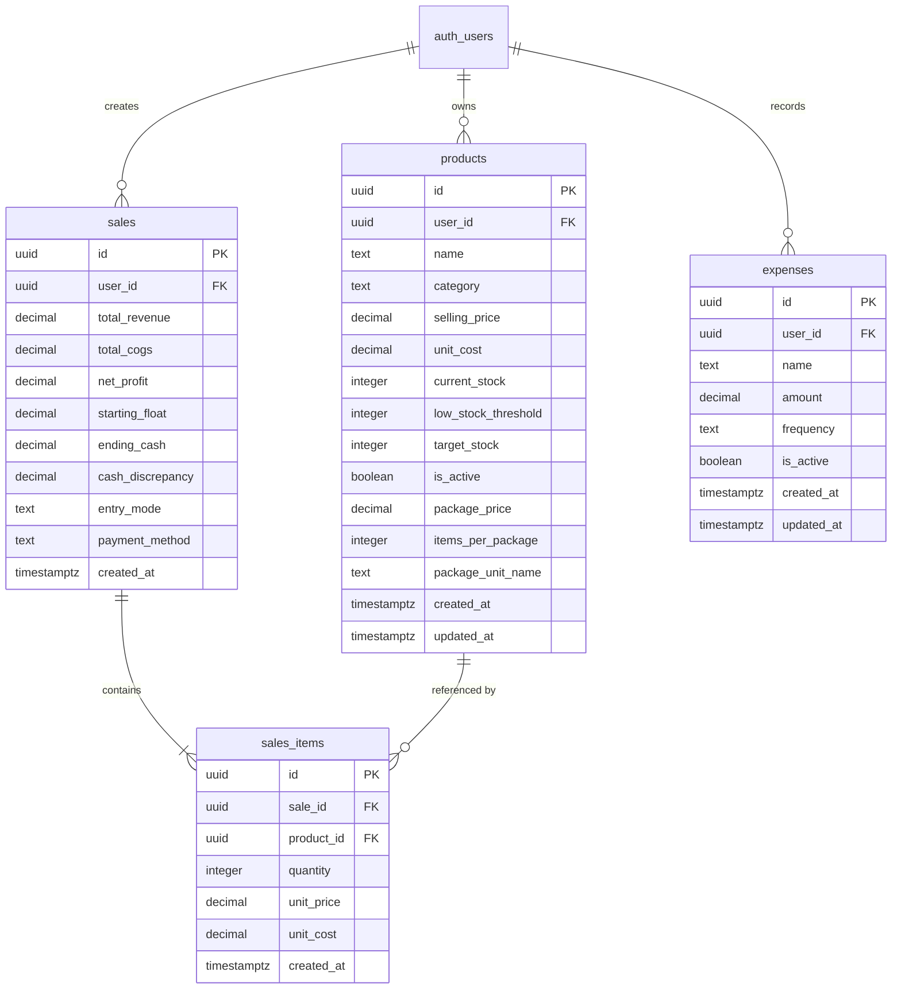

---
# Database Schema Documentation — Mellow Café System

> **Auto-generated by DocCraft** | Source: `file:///c:/Users/cyril/OneDrive/Desktop/Mellow/supabase/migrations/` | Last verified: 2026-07-25
>
> ⚠️ If this documentation doesn't match the code, the CODE is the source of truth. Please update these docs.

---

## Overview

The **Mellow Café System** database is hosted on **Supabase (PostgreSQL)** and uses **Row-Level Security (RLS)** to enforce multi-tenant user isolation based on `auth.uid() = user_id`.

The system consists of 4 main tables:
1. `products` — Inventory items, menu products, raw materials, and package/bulk costing parameters.
2. `sales` — Sale transactions, quick taps, batch entries, and daily cash reconciliation records.
3. `sales_items` — Line items linking sales to products with historical price and cost tracking.
4. `expenses` — Operating overheads and recurring business costs.

---

## Entity Relationship Diagram (ERD)



---

## Table Specifications

### 1. `products`

Stores menu items and raw materials, including bulk purchasing / package costing metrics.

| Column | Type | Constraints | Default | Description |
|---|---|---|---|---|
| `id` | `UUID` | `PRIMARY KEY` | `gen_random_uuid()` | Unique product identifier |
| `user_id` | `UUID` | `NOT NULL, FK -> auth.users(id)` | None | Owner ID (soft reference to Supabase Auth) |
| `name` | `TEXT` | `NOT NULL` | None | Product name (e.g., "Spanish Latte", "Espresso Beans") |
| `category` | `TEXT` | `NOT NULL` | `'Uncategorized'` | Product category |
| `selling_price` | `DECIMAL(10,2)`| `NOT NULL, CHECK (>= 0)` | `0.00` | Retail price charged to customers |
| `unit_cost` | `DECIMAL(10,2)` | `NOT NULL, CHECK (>= 0)` | `0.00` | Cost of Goods Sold (COGS) per individual unit |
| `current_stock` | `INTEGER` | `NOT NULL` | `0` | Current quantity on hand (can be negative on over-sale) |
| `low_stock_threshold` | `INTEGER` | `NOT NULL` | `5` | Reorder warning trigger level |
| `target_stock` | `INTEGER` | `NOT NULL` | `20` | Desired inventory restocking level |
| `is_active` | `BOOLEAN` | `NOT NULL` | `TRUE` | Soft deletion / active menu toggle |
| `package_price` | `DECIMAL(10,2)`| `NULLABLE` | `NULL` | Bulk purchase price for a box/case |
| `items_per_package`| `INTEGER` | `CHECK (>= 1)` | `1` | Number of individual pieces per bulk box/case |
| `package_unit_name`| `TEXT` | `NULLABLE` | `'box'` | Label for bulk unit (e.g., "box", "case", "pack", "sack") |
| `created_at` | `TIMESTAMPTZ` | | `NOW()` | Creation timestamp |
| `updated_at` | `TIMESTAMPTZ` | | `NOW()` | Last modification timestamp (updated by trigger) |

#### Triggers & Indexes
- **Trigger:** `update_products_updated_at` fires `BEFORE UPDATE` to auto-set `updated_at = NOW()`.
- **Index:** `idx_products_user_id` on `(user_id)`.

---

### 2. `sales`

Header record for completed sales transactions and cash reconciliation entries.

| Column | Type | Constraints | Default | Description |
|---|---|---|---|---|
| `id` | `UUID` | `PRIMARY KEY` | `gen_random_uuid()` | Unique transaction ID |
| `user_id` | `UUID` | `NOT NULL, FK -> auth.users(id)` | None | Cashier/Owner user ID |
| `total_revenue` | `DECIMAL(10,2)`| `NOT NULL` | `0` | Sum of selling prices for all items sold |
| `total_cogs` | `DECIMAL(10,2)`| `NOT NULL` | `0` | Total cost of items sold |
| `net_profit` | `DECIMAL(10,2)`| `NOT NULL` | `0` | `total_revenue - total_cogs` |
| `starting_float`| `DECIMAL(10,2)`| `NULLABLE` | `NULL` | Opening register float (used in `reconciliation`) |
| `ending_cash` | `DECIMAL(10,2)`| `NULLABLE` | `NULL` | Counted physical cash at end of day |
| `cash_discrepancy`|`DECIMAL(10,2)`| `NULLABLE` | `NULL` | Over/short difference: `ending_cash - (starting_float + cash_sales)` |
| `entry_mode` | `TEXT` | `CHECK IN ('quick_tap', 'batch', 'reconciliation')` | None | Mode used to record entry |
| `payment_method`| `TEXT` | `CHECK IN ('cash', 'gcash_maya')` | `'cash'` | Method of payment |
| `created_at` | `TIMESTAMPTZ` | | `NOW()` | Transaction timestamp |

#### Indexes
- **Index:** `idx_sales_user_id` on `(user_id)`.
- **Index:** `idx_sales_created_at` on `(created_at)`.

---

### 3. `sales_items`

Line items belonging to a sale header. Stores snapshot unit price and unit cost at time of sale to preserve historical analytics accuracy.

| Column | Type | Constraints | Default | Description |
|---|---|---|---|---|
| `id` | `UUID` | `PRIMARY KEY` | `gen_random_uuid()` | Line item ID |
| `sale_id` | `UUID` | `NOT NULL, FK -> sales(id) ON DELETE CASCADE` | None | Parent sale record |
| `product_id` | `UUID` | `NOT NULL, FK -> products(id) ON DELETE RESTRICT` | None | Product sold |
| `quantity` | `INTEGER` | `NOT NULL, CHECK (quantity > 0)` | None | Quantity sold |
| `unit_price` | `DECIMAL(10,2)`| `NOT NULL` | None | Snapshot selling price per item |
| `unit_cost` | `DECIMAL(10,2)`| `NOT NULL` | None | Snapshot cost per item at sale time |
| `created_at` | `TIMESTAMPTZ` | | `NOW()` | Creation timestamp |

#### Indexes
- **Index:** `idx_sales_items_sale_id` on `(sale_id)`.
- **Index:** `idx_sales_items_product_id` on `(product_id)`.

---

### 4. `expenses`

Tracks operating overheads and recurring expenses.

| Column | Type | Constraints | Default | Description |
|---|---|---|---|---|
| `id` | `UUID` | `PRIMARY KEY` | `gen_random_uuid()` | Expense ID |
| `user_id` | `UUID` | `NOT NULL, FK -> auth.users(id)` | None | Owner ID |
| `name` | `TEXT` | `NOT NULL` | None | Expense title (e.g., "Shop Rent", "Electricity") |
| `amount` | `DECIMAL(10,2)`| `NOT NULL, CHECK (amount >= 0)` | None | Cost amount |
| `frequency` | `TEXT` | `CHECK IN ('daily', 'weekly', 'monthly', 'yearly')` | `'monthly'` | Recurrence interval |
| `is_active` | `BOOLEAN` | `NOT NULL` | `TRUE` | Active tracking toggle |
| `created_at` | `TIMESTAMPTZ` | | `NOW()` | Record created timestamp |
| `updated_at` | `TIMESTAMPTZ` | | `NOW()` | Record updated timestamp |

---

## Row-Level Security (RLS) Policies

Row-Level Security is enabled on **all tables** to isolate user data completely.

- **`products`**:
  - `SELECT`, `INSERT`, `UPDATE`, `DELETE`: `auth.uid() = user_id`
- **`sales`**:
  - `SELECT`, `INSERT`, `UPDATE`, `DELETE`: `auth.uid() = user_id`
- **`expenses`**:
  - `SELECT`, `INSERT`, `UPDATE`, `DELETE`: `auth.uid() = user_id`
- **`sales_items`**:
  - `SELECT`, `INSERT`, `UPDATE`, `DELETE`: Subquery check `EXISTS (SELECT 1 FROM sales WHERE sales.id = sales_items.sale_id AND sales.user_id = auth.uid())`

---

## Common Query Patterns

### 1. Fetch Today's Revenue and Profit Summary
```sql
SELECT 
    COALESCE(SUM(total_revenue), 0) AS total_revenue,
    COALESCE(SUM(total_cogs), 0) AS total_cogs,
    COALESCE(SUM(net_profit), 0) AS net_profit,
    COUNT(*) AS transaction_count
FROM public.sales
WHERE user_id = auth.uid()
  AND entry_mode != 'reconciliation'
  AND created_at >= DATE_TRUNC('day', NOW());
```

### 2. Identify Low Stock Products Needing Restock
```sql
SELECT id, name, category, current_stock, low_stock_threshold, target_stock, package_price, items_per_package, package_unit_name
FROM public.products
WHERE user_id = auth.uid()
  AND is_active = true
  AND current_stock <= low_stock_threshold
ORDER BY current_stock ASC;
```
