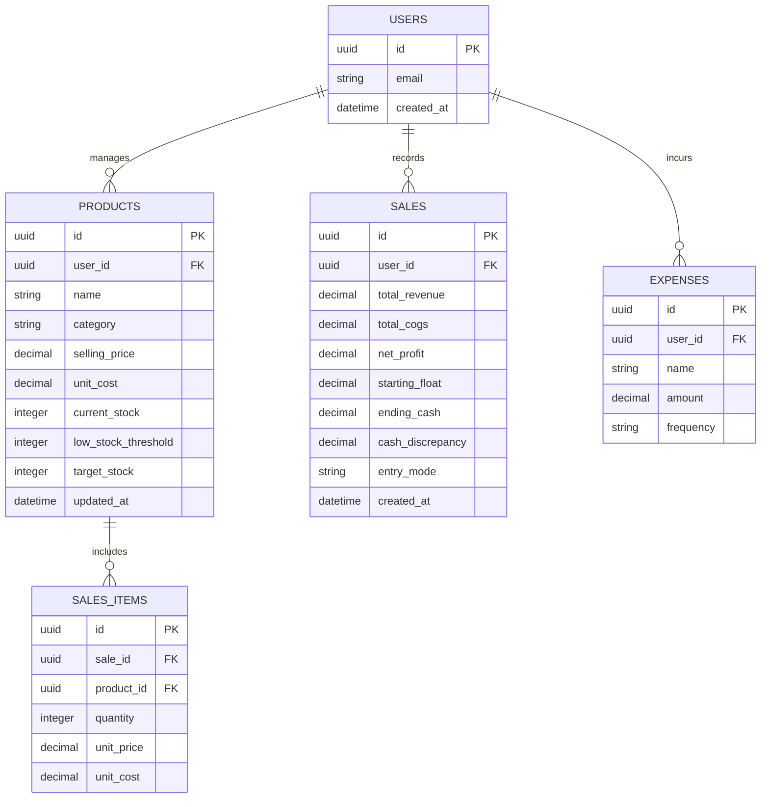

# Project Specification: Mellow Café System

## 1. Executive Summary
- **Product:** Mellow Café System — Small Café Sales, Stock & Financial Intelligence System
- **Problem:** Small café owners waste time manually tracking sales, stock, and margins, leading to stockouts, unknown daily profits, and tedious closing routines without budget for expensive POS hardware/software.
- **Solution:** A lightweight, single-user mobile-responsive web application that simplifies sales logging (live tap, batch end-of-day, cash drawer reconciliation), unit stock tracking, automated shopping list generation, real-time profit analytics, and business calculators—all hosted on 100% free cloud tiers.
- **Platform:** Web Application (Mobile & Desktop Responsive PWA/SPA)
- **Target Launch:** 2-3 Weeks (MVP)
- **Scope:** MVP (Single-user owner system)

---

## 2. User Personas & Workflows

### Café Owner / Manager (Sole User)
- **Role:** Sole operator responsible for daily sales logging, closing reconciliation, purchasing supplies, and tracking overall profitability.
- **Primary Goal:** Track daily net profit in Philippine Pesos (₱), maintain stock levels without running out of items, generate quick restock shopping lists, and run closing reconciliation fast.
- **Key Workflows:**
  1. **Mid-Day Quick Logger:** Tap item icons on phone browser during peak hours to record immediate sales.
  2. **End-of-Day Closing & Reconciliation:** Input cash float, count ending cash, enter batch sales quantities, compare expected vs actual cash, and view net profit for the day.
  3. **Restock Run:** Check Low Stock Alerts tab, generate an automated shopping list with reorder quantities, and copy/export to WhatsApp/SMS for supplier runs.
- **Frequency:** Daily (multiple micro-sessions throughout the day and closing session at night).
- **Pain Points:** Paper log errors, buying the wrong quantities at wholesale markets, uncalculated food/drink costs, lack of clear net profit visibility.

---

## 3. Feature Specification

### MVP Features (Must Ship)

#### 1. Multi-Mode Sales Logger
- **Description:** Flexible sales recording interface supporting real-time logging, batch entry, and cash drawer reconciliation.
- **User Story:** "As a café owner, I want multiple ways to log my sales so I can quickly tap items during busy hours or enter batch numbers at closing."
- **Inputs:** 
  - Mode A (Quick Tap): Single tap per item sold.
  - Mode B (Batch Entry): Item quantities sold for the day.
  - Mode C (Cash Reconciliation): Starting Cash Float (₱), Ending Physical Cash (₱).
- **Outputs:** Recorded transaction logs, updated stock counts, Cash Over/Short alert (₱ difference).
- **Business Rules:**
  - Sales immediately decrement unit inventory stock levels.
  - System calculates Expected Cash = `Starting Float + Cash Sales`.
  - Discrepancy = `Ending Physical Cash - Expected Cash`.
- **Edge Cases:** Negative stock warning if sales exceed recorded inventory (allows sale but flags stock as 0 or negative with warning).

#### 2. Inventory & Low Stock Tracking
- **Description:** Simple unit-based inventory management for finished goods and ingredients.
- **User Story:** "As a café owner, I want to track item stock levels so I get alerted before running out of key supplies."
- **Inputs:** Item Name, Category, Unit Cost (COGS in ₱), Selling Price (₱), Current Stock, Low Stock Threshold, Target Stock Level.
- **Outputs:** Stock list with visual color-coded badges (Green = Good, Yellow = Low, Red = Out of Stock).
- **Business Rules:** Item marked as "Low Stock" whenever `Current Stock <= Low Stock Threshold`.

#### 3. Automated Shopping List Generator
- **Description:** Instant restock checklist builder based on low inventory items.
- **User Story:** "As a café owner, I want a shopping list auto-generated from low stock items so I know exactly what to buy and how much."
- **Inputs:** Auto-fetched low stock items + option to add ad-hoc manual items (e.g. "Paper Towels").
- **Outputs:** Printable/shareable restock list with recommended purchase quantities (`Target Stock - Current Stock`).
- **Business Rules:** 
  - Recommended Qty = `Max(0, Target Stock - Current Stock)`.
  - One-tap "Copy to Clipboard" formatted for WhatsApp/SMS message.

#### 4. Financial Dashboard & Profit Intelligence
- **Description:** Central visual hub highlighting key financial metrics in Philippine Pesos (₱).
- **User Story:** "As a café owner, I want to see today's profit and revenue at a glance so I know how the business is performing."
- **Inputs:** Sales log data, unit cost data, fixed expense inputs.
- **Outputs:** Today's Net Profit (₱), Today's Gross Revenue (₱), Total Items Sold, Low Stock Alert Count, Monthly Net Profit chart.
- **Business Rules:**
  - `Gross Sales = Sum(Quantity * Selling Price)`
  - `Total COGS = Sum(Quantity * Unit Cost)`
  - `Net Profit = Gross Sales - Total COGS - (Pro-rated Fixed Expenses)`

#### 5. Business Calculators
- **Description:** Embedded financial tools to help price menu items and plan sales targets.
- **User Story:** "As a café owner, I want margin and breakeven calculators so I can set profitable menu prices and know my daily sales target."
- **Inputs:** Item COGS, desired selling price OR desired margin %; Fixed monthly costs (Rent, Utilities).
- **Outputs:** Profit margin %, profit per item (₱), daily cups/items needed to break even.
- **Calculations:**
  - `Margin % = ((Selling Price - COGS) / Selling Price) * 100`
  - `Breakeven Items/Day = Monthly Fixed Costs / (Average Margin per Item * 30 days)`

#### 6. Historical Reports & Data Export
- **Description:** Date-filtered sales and profit history with CSV backup capabilities.
- **User Story:** "As a café owner, I want to view past weekly and monthly performance and export data to CSV for bookkeeping."
- **Inputs:** Date range pickers (Today, Last 7 Days, This Month, Custom Range).
- **Outputs:** Historical sales graphs, top-selling items ranking, downloadable CSV reports.

---

### Anti-Features (Explicitly Out of Scope)
- ❌ **Recipe/Ingredient Multi-level Deductions:** No gram-by-gram espresso/milk breakdown in MVP (kept to simple unit stock to maintain speed and simplicity).
- ❌ **Multi-staff Login & Role Permissions:** Single-owner authentication only.
- ❌ **Hardware Printers / Barcode Scanners / Cash Drawer Triggers:** Software-only solution running on standard phone/laptop browser.
- ❌ **Tax / VAT Management:** Explicitly excluded as requested.

---

## 4. Technical Architecture

### Stack Specification

| Layer | Technology | Justification |
|---|---|---|
| **Frontend Framework** | Next.js 14+ (App Router) | High performance, mobile-friendly PWA capabilities, seamless deployment on Vercel. |
| **Styling** | Tailwind CSS + Lucide Icons | Rapid UI construction, clean modern aesthetic, responsive utility-first design. |
| **Backend & DB** | Supabase (PostgreSQL) | Free tier includes DB, API, and Auth. Excellent developer experience with real-time updates. |
| **Authentication** | Supabase Auth (Email + Password) | Single-user secure access with persistent sessions across mobile and desktop. |
| **Hosting & CI/CD** | Vercel (Free Tier) | $0 hosting cost, automatic git deployments, fast CDN performance in SEA region. |

### Data Model (Key Entities)

---

## 5. Design Direction
- **Aesthetic:** Modern, warm café-inspired dark/light theme (Warm Amber/Espresso primary accents `#D97706` / `#451A03`, Neutral Dark backgrounds `#18181B`).
- **Typography:** Inter or Outfit (Clean, readable on small mobile screens).
- **Mobile First Layout:** Large touch targets (min 48px height for quick logger buttons), bottom tab navigation for thumb friendly single-hand phone usage.
- **Key Screens:**
  1. **Dashboard:** Daily Net Profit banner (₱), Gross Revenue, Low Stock widget, Quick Actions.
  2. **Sales Logger:** Grid of product buttons (Quick Tap) + Mode switchers for Batch & Cash Reconciliation.
  3. **Stock & Shopping List:** Inventory table + Auto-generated restock checklist with one-tap Copy/Share button.
  4. **Analytics & Reports:** Sales charts, Top-performing products, Date filters, CSV download button.
  5. **Calculators:** Margin & Breakeven interactive input cards.

---

## 6. Security & Compliance
- **Security Tier:** MVP/Basic Production
- **Authentication:** Password-protected login via Supabase Auth.
- **Data Protection:** Supabase Row Level Security (RLS) policies enforcing `auth.uid() = user_id` for all queries.
- **Environment Variables:** Secret keys (`NEXT_PUBLIC_SUPABASE_URL`, `SUPABASE_SERVICE_ROLE_KEY`) safely stored in Vercel environment variables.

---

## 7. Infrastructure & DevOps
- **Hosting:** Vercel free project deployment.
- **Database:** Supabase hosted PostgreSQL instance.
- **Cost:** ₱0 / $0 monthly running cost on free tier limits.
- **Backups:** Supabase automated daily database snapshots + manual CSV export option.

---

## 8. Project Phases & Milestones

| Phase | Focus | Duration | Key Deliverables |
|---|---|---|---|
| **Phase 0** | Setup & Infrastructure | Day 1 | Next.js project init, Supabase database schema & RLS policies script. |
| **Phase 1** | Auth & Product Inventory | Days 2-4 | Login screen, Product CRUD (Create, Read, Update, Delete), Low stock flags. |
| **Phase 2** | Multi-Mode Sales Engine | Days 5-8 | Quick Tap logger, Batch Entry form, Cash Reconciliation drawer calculations. |
| **Phase 3** | Shopping List & Calculators | Days 9-11 | Auto restock generator, WhatsApp export, Margin & Breakeven calculators. |
| **Phase 4** | Dashboard & Analytics | Days 12-14 | Today's Profit metrics, historical charts, date filtering, CSV exporter. |
| **Phase 5** | Polish, Mobile QA & Launch | Days 15-16 | Touch optimization, PWA install prompt, final testing, production deployment. |

---

## 9. Open Questions & Risks
- **Risk:** Internet Connectivity loss during peak hours.
  - *Mitigation:* Next.js local state / IndexedDB caching so sales can be logged offline and synced when connection returns.
- **Open Decision:** Option to add quick custom discount buttons (e.g. Senior/PWD discount or 10% promo) in V1.1.

---

## 10. Success Metrics
- **Daily Closing Time:** Reduced from 30+ minutes manual math to under 3 minutes.
- **Stockout Reduction:** Zero stockouts on high-margin items due to Low Stock alerts & Shopping List.
- **Financial Clarity:** 100% immediate daily visibility into net profit in Philippine Pesos (₱).

---

## 11. Recommended Implementation Skills

| Phase | Skills / Guidelines | Purpose |
|---|---|---|
| **Phase 0: Setup** | `Next.js App Router`, `Tailwind CSS`, `Supabase CLI` | Baseline architecture, environment config, DB migration |
| **Phase 1: DB & Auth** | `Supabase RLS`, `TypeScript`, `Prisma/PostgreSQL` | Secure database setup, schema constraints, auth session persistence |
| **Phase 2: Core Sales** | `React Hooks`, `Zustand / State Management` | Fast responsive tap logger UI, offline queue state |
| **Phase 3: Shopping List & Tools** | `Web Share API`, `Clipboard API` | Native device sharing to WhatsApp/SMS, calculations utility functions |
| **Phase 4: Analytics** | `Recharts / Chart.js`, `CSV Exporter` | Visual financial charts, data formatting in ₱ (PHP currency) |
| **Phase 5: Launch** | `Vercel Deployment`, `PWA Web Manifest` | Production deployment, mobile home-screen installable PWA setup |
